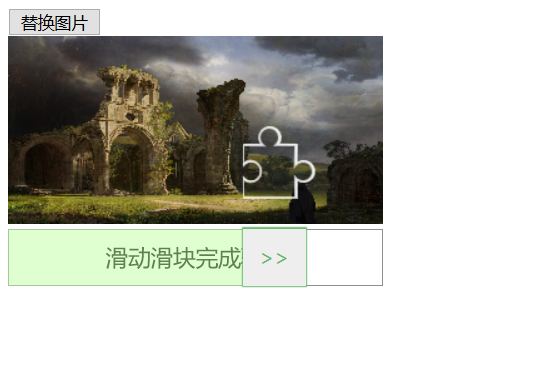
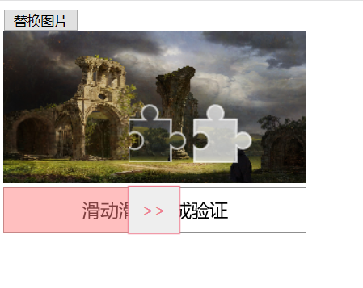

# vue-vertify

滑动验证组件

使用方式:

1. npm install vue-vertify
2. 项目中  

```js
import SlideVertify from 'vue-vertify/dist/PtVertify.common.js' 
import 'vue-vertify/dist/PtVertify.css' 

```

3. 传入回调函数


```html
<PtVertify
  ref="ptVertify"
  :options="{
    src: 'https://w.wallhaven.cc/full/96/wallhaven-96g2p8.jpg',// 必传, 初始化图片路径
    width: 300, // 整个组件的宽度 不能用百分比, 你可以用百分比计算好宽度后传进
    canvasHeight: 150, // 拼图背景canvas的高
    markWidth: 60, // 移动拼图的宽
    markHeight: 60, // 移动拼图的高
    slideWidth: 50, // 滑块的宽度
    gap: 20, // 移动拼图块与与随机截取区域的间隔, 预防随机截取区域过大导致 移动拼图块与截取的拼图快位置重叠
    r: 8, // 拼图圆弧的半径
    vertifyCallback: handleVertify, // 成功回调, 应与服务器进行交互验证, 返回一个promise, 必传
    vertifyErrorCallback: handleVertifyError // 验证失败的回调, 默认行为滑块会自动回到初始位置
  }"
/>
```

## 效果图



